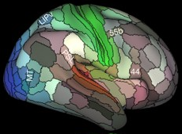

# Description
This workshop will cover what open access datasets are, where to find them, and will provide some suggestions on how to deal with them. During the workshop, we will be playing around with some behavioral data from the Human Connectome Project. The workshop will go through the steps to obtain this dataset. 

# Prerequisites
* Basic knowledge of Jupyter Notebook
* Basic knowledge or R (syntax, importing data)

# To-do Before Workshop
1. Install the [R kernal](https://irkernel.github.io/installation/) for Jupyter. This will allow you to use R with Jupyter
2. Download the workshop material.
    1. This can be done manually by downloading the entire [COG Summer Workshops 2020 repo](https://github.com/TU-Coding-Outreach-Group/cog_summer_workshops_2020)
    2. Or you can use git:
        1. Open a bash terminal
        2. Run `git remote add upstream https://github.com/TU-Coding-Outreach-Group/cog_summer_workshops_2020.git`
        3. Run the commands from [this post](https://help.github.com/en/github/collaborating-with-issues-and-pull-requests/syncing-a-fork), starting at step 3. After completing this steps, you will have updated your local repo with the materials from the cloud COG group github repo. 
        4. Now you should update your own github repo in the cloud, by pushing the local repo you have just updated. This can be done by the following commands when you are in the "cog_summer_workshops_2020" repo where all of the workshop materials are and the hidden .git file:
            1. `git add open-access-datasets`
            2. `git commit -m "update repo with new workshop materials` or whatever you want this message to be
            3. `git push`

__Note: To more easily keep an updated list of open access datasets, a comprehensive list will be kept below. This list will be more frequenctly updated than the list in the Jupyter notebook.__

# Open Access Datasets
* [OpenNeuro](https://openneuro.org/)
    * Database of publically available single-study datasets
* [Brain Genomics Superstruct Project (GSP)](https://dataverse.harvard.edu/dataverse/GSP)
    * A collection of neuroimaing, behavior, cognitive, and personality data for over 1,500 human participants
    * This dataset was used in [Yeo et al., 2011](https://journals.physiology.org/doi/full/10.1152/jn.00338.2011) to create the widely used Yeo 7-network atlas
* [Adolescent Brain Cognitive Development (ABCD)](https://nda.nih.gov/abcd)
    * Longitudinal study of brain development and child health from 21 sites
    * Measured social, emotional, cognitive development, as well as health and environmental outcomes
    * This dataset is somewhat notorious for its various issues
        * The imaging data is very troublesome, as it is from different sites, with different scanners, scanner software, head-coils, etc.
* [Human Connectome Project (HCP)](https://www.humanconnectome.org/study/hcp-young-adult)
    * The HCP young adult dataset was collected on the same MRI scanner model across three different sites
    * It is very high quality considering the multi-site nature of the dataset and the large sample size (1200)
        * The researchers took careful consideration of the issues with multi-site studies and ensured that all studies were using the same type of scanner, scanner software, head-coil, and protocol
    * Includes multi-modal data from fMRI tasks, fMRI resting state, DWI, and high resolution T1 structural scans, along with behavioral and cognitive data
    * Most of the data is available fully preprocessed via their [Minimal Preprocessing Pipeline](https://pubmed.ncbi.nlm.nih.gov/23668970/)
    * Additional HCP datasets
        * [HCP Development](https://www.humanconnectome.org/study/hcp-lifespan-development)
        * [HCP Aging](https://www.humanconnectome.org/study/hcp-lifespan-aging)
        * Human disease (Alzheimer's, anxiety and depression, etc.) datasets to come
    
* [Autism Brain Imaging Data Exchange (ABIDE)](http://fcon_1000.projects.nitrc.org/indi/abide/abide_I.html)
* [Open Access Series of Imaging Studies (OASIS)](https://www.oasis-brains.org/)
* [Alzheimer's Disease Neuroimaing Initiative (ADNI)](http://adni.loni.usc.edu/)
* [Amsterdam Oen MRI Collection (AOMIC)](https://nilab-uva.github.io/AOMIC.github.io/)
* [Open psychological datasets](https://docs.google.com/spreadsheets/d/1ejOJTNTL5ApCuGTUciV0REEEAqvhI2Rd2FCoj7afops/edit#gid=0)
    * Another, more comprehensive list of open access datasets, that also include non-imaging psychology datasets

